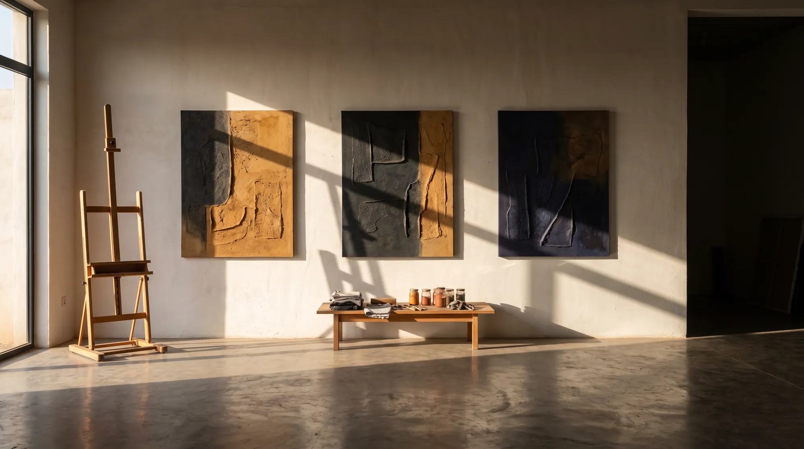

# ANGY ART — les images à produire

**À lire avant de générer quoi que ce soit.**

Le site est construit pour recevoir six images. Quatre sont de l'**ambiance** : l'IA est
autorisée, c'est ce qu'on a déjà fait chez Miss cakes et Au Braisé d'Or. Deux sont le
**catalogue** : le héros et le carrousel. Une toile générée par IA à ces deux endroits
devient « une œuvre d'Angélique » aux yeux d'un collectionneur qui écrit pour l'acheter,
et c'est elle qui répond quand la pièce n'existe pas.

D'où la règle de ce document :

| Emplacement | Ce qu'on génère | Statut |
|---|---|---|
| 1. Héros | **la matière**, en macro (relief, entailles, pigment) | ✅ générable |
| 2. La démarche | mains au travail, atelier | ✅ générable |
| 3. Carrousel | ⛔ **ses vraies œuvres** | photos à faire, § 3 |
| 4. L'atelier | la salle, lumière rasante, toiles retournées | ✅ générable |
| 5. La citation | macro de lin brut / textile | ✅ générable |
| 6. La visite | la salle le soir, lumière chaude | ✅ générable |

**Le fil rouge de toutes les images : la lumière rasante.** Une lumière qui vient
franchement du côté, jamais de face. C'est ce qui révèle un relief, c'est la phrase du
site, et c'est ce qui les fera toutes appartenir à la même série.

**Palette à respecter dans chaque prompt** : noir `#0a0a0a`, crème `#f3efe6`,
or beige `#c9b99a`, plus les ocres et bruns de ses pigments.

---

## Comment poser une image une fois générée

Le code est déjà prêt. **Une seule balise suffit**, et le dessin de substitution
s'efface tout seul :

```html
<div class="scene scene--atelier" aria-hidden="true">
  
  <i class="rai"></i>
  ...
</div>
```

La photo se pose **sous** la lumière rasante : le balayage continue de passer dessus,
comme il passe aujourd'hui sur la matière dessinée.

Ensuite : `python _qc.py --voir`, regarder les captures, bumper le `?v=`, redéployer.

**Format de sortie** : générer en PNG haute définition, puis convertir en **WebP qualité 82**
et poser dans `assets/images/scenes/`. Viser **250 Ko par image, 400 Ko maximum** : à Cotonou
le site se charge en 4G.

---

## 1. HÉROS — la matière, en macro

`assets/images/scenes/hero.webp` · **format 4:5** (≈ 1200 × 1500) · va dans l'arche du héros

> Extreme macro photograph of a hand-made textured painting surface. Thick impasto ridges
> and deep hand-carved incisions forming subtle geometric scarification-like marks. Raw
> linen canvas weave visible where the paint thins out. Deep charcoal black, warm burnt
> ochre and raw umber pigments, with faint pale gold highlights catching the edges of the
> ridges. Hard raking side light from the left, grazing the surface at a very low angle,
> carving long dramatic shadows across every ridge and groove. Background falls off into
> near-black. Shot on a 100mm macro lens, f/5.6, tack sharp on the relief, fine art
> photography, museum quality. Vertical 4:5 composition. No text, no signature, no
> watermark, no frame, no human figure.

**Pourquoi ça marche et pourquoi c'est honnête** : ce n'est pas une œuvre au catalogue,
c'est de la matière. Personne ne peut écrire « je veux acheter celle-là ». Et c'est
exactement le sujet du site : le relief ne se voit pas de face.

**Variante à essayer aussi** (garder la meilleure) : remplacer « geometric
scarification-like marks » par « concentric arcs and chevrons carved into the surface ».

---

## 2. LA DÉMARCHE — les mains au travail

`assets/images/scenes/demarche.webp` · **format 5:6** (≈ 1100 × 1320)

> Documentary fine art photograph of a Black West African woman artist's hands at work in
> her studio. Hands only, face and body out of frame. Fingers pressing thick ochre pigment
> into the raised surface of a textured painting, a worn palette knife resting beside them,
> pigment under the fingernails, a few old brushes and a jar out of focus behind. Raw linen
> canvas. Warm burnt ochre, raw umber and deep brown against a dark studio background. Soft
> directional window light from the left, warm and low, dust floating in the beam, deep
> shadows on the right. Shot on a 50mm lens, f/2.8, shallow depth of field, natural warm
> color grade, no artificial saturation. Vertical composition. No text, no watermark,
> no visible face.

⚠️ **« Hands only, face and body out of frame »** est important : une photo de visage
laisserait croire que c'est Angélique. Ce n'est pas elle. Les mains, ça reste vrai.

---

## 3. LE CARROUSEL — ⛔ ses vraies œuvres, pas de l'IA

**C'est la seule chose qui manque vraiment au site, et c'est la seule qu'on ne peut pas
faire à sa place.** Le carrousel montre aujourd'hui les matières de l'atelier, ce qui est
honnête. Le remplacer par des toiles générées, c'est mettre en vente ce qui n'existe pas.

### Ce qu'il faut lui demander : 6 à 8 photos, prises en une heure

À envoyer telle quelle sur WhatsApp :

> Bonjour Angélique, pour le carrousel du site il me faut **6 à 8 photos de vos œuvres**.
> Pas besoin de studio, votre téléphone suffit si vous respectez ces cinq points :
>
> 1. **Dehors, à l'ombre, en fin d'après-midi.** Jamais au flash : le flash écrase le
>    relief, et c'est le relief qu'on vend.
> 2. **La lumière vient d'un côté**, pas de face. Tournez la toile jusqu'à voir les
>    ombres apparaître dans les creux.
> 3. **Fond neutre** : un mur clair uni, ou un drap sombre. Rien d'autre dans le cadre.
> 4. **L'appareil bien en face du centre de la toile**, à la même hauteur, la toile
>    droite. Pas d'angle.
> 5. **Une photo par œuvre**, cadrée sur la toile seule, sans le mur autour.
>
> Et pour chacune, envoyez-moi : **le titre, la technique, les dimensions en cm, l'année**,
> et si elle est **disponible ou vendue**.

### Où ça se pose

Une ligne par œuvre, tout en haut de `assets/app.js` :

```js
var OEUVRES = [
  { f:'racines.webp', t:'Racines', tech:'Technique mixte, relief',
    an:'2026', mat:'Pigment, lin brut, matériaux rapportés', ar:'4/5' },
];
```

Dès la première ligne, les matières disparaissent et les œuvres prennent leur place :
cartel, compteur et vue en grand suivent tout seuls.

### Si vous voulez quand même compléter visuellement

Générez **des matières supplémentaires**, pas des œuvres. Reprenez le prompt du héros en
changeant la dominante à chaque fois : `indigo textile weave` · `crushed red ochre` ·
`charcoal and ash` · `pale kaolin white` · `copper leaf on dark ground`. Elles s'ajoutent
au carrousel actuel sans jamais prétendre être des pièces à vendre.

---

## 4. L'ATELIER — la salle, plein écran

`assets/images/scenes/atelier.webp` · **format 16:9** (≈ 2000 × 1125)

> Wide architectural photograph of a contemporary artist's studio in West Africa, empty of
> people. Textured off-white plaster walls, polished concrete floor. Several large canvases
> **stacked leaning against the wall with their backs turned to the camera**, raw wooden
> stretcher bars visible. One tall easel on the left holding a canvas seen from behind.
> A low table with jars of pigment, folded cloth, brushes. Late afternoon sun entering
> hard from a tall window on the far left, raking across the wall at a very low angle,
> a long bright beam on the floor, dust suspended in the light, deep shadows filling the
> right half of the frame. Warm ochre and bone-white tones against deep shadow. Shot on a
> 24mm lens, f/8, architectural photography, no people, no text, no watermark.

⚠️ **« backs turned to the camera » et « seen from behind »** : c'est ce qui rend l'image
honnête. On voit un vrai atelier, on ne fabrique pas de fausses toiles au mur. Et
visuellement c'est plus fort : on a envie de voir ce qu'il y a de l'autre côté.

---

## 5. LA CITATION — le lin, de très près

`assets/images/scenes/lin.webp` · **format 4:5 vertical** (≈ 1100 × 1400)

> Extreme macro photograph of raw unprimed linen canvas stretched tight, the weave clearly
> visible thread by thread, a few slubs and irregularities in the fibres. One faint diagonal
> smear of warm ochre pigment across the lower third, dry and thin, letting the weave show
> through. Warm natural fibre tones, pale bone and sand, against deep shadow at the edges.
> Hard raking light from the upper left at a very low angle, each thread casting its own tiny
> shadow. Shot on a 100mm macro lens, f/8, extremely detailed, tactile, fine art photography.
> Vertical composition. No text, no watermark, no human figure.

---

## 6. LA VISITE — la salle le soir

`assets/images/scenes/soir.webp` · **format 16:9** (≈ 2000 × 1125)

> Wide photograph of the same West African artist's studio at night, empty of people. Warm
> tungsten picture lights glowing low on a textured plaster wall, pools of amber light
> falling off fast into deep darkness. Canvases stacked against the wall with their backs
> to the camera, one easel silhouetted. A single work light on a stand casting a hard
> raking beam across the wall texture. Deep warm amber and near-black, almost no mid-tones.
> Intimate, quiet, after-hours atmosphere. Shot on a 35mm lens, f/2, long exposure feel,
> cinematic, no people, no text, no watermark.

---

## Trois consignes qui valent pour les six

1. **Toujours ajouter à la fin** : `no text, no signature, no watermark, no logo`.
   Un faux texte dans une image est immédiatement visible et ruine tout.
2. **Générer 3 ou 4 fois le même prompt et choisir**, plutôt que d'accepter la première.
   Sur Au Braisé d'Or, c'est la comparaison qui a fait la différence.
3. **Les regarder ensemble, côte à côte, avant de les poser.** Six belles images qui ne
   se ressemblent pas font un site incohérent. Si l'une jure, c'est la lumière : elle doit
   venir du côté, dans les six.

---

## Ce que le site gagne, image par image

| Sans | Avec |
|---|---|
| Héros : arche de matière dessinée | une matière réelle, en gros plan, qui donne envie de toucher |
| Démarche : tracés SVG | des mains dans le pigment, le geste du métier |
| Carrousel : cinq matières | **ses œuvres** — le seul écran qui déclenche un achat |
| Atelier : cadres au trait | une vraie salle, une vraie lumière |
| Citation : trame de lin dessinée | du lin réel, fil par fil |
| Visite : mur du soir | l'atelier après la fermeture |

**L'ordre d'importance, si vous n'en faites que trois** : le carrousel (ses vraies œuvres),
le héros, puis l'atelier.
